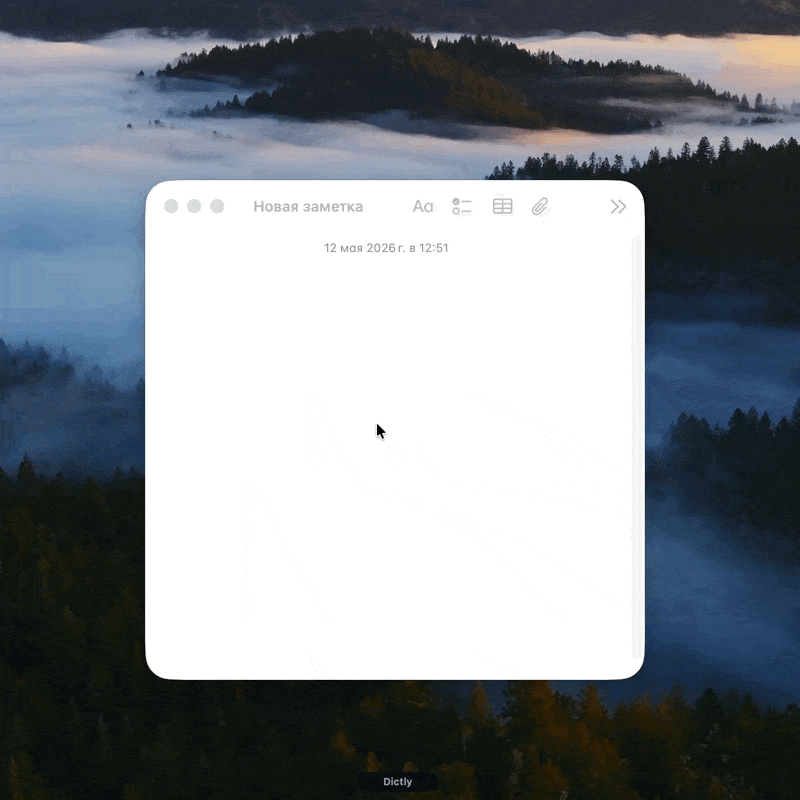

  

<h1 align="center">Dictly</h1>

  <b>Голос в текст для разработчиков.</b> 
  Диктуете — получаете чистый, отформатированный текст прямо в активном приложении: терминал, заметки, редактор кода.

  <a href="../../releases/latest"><b>⬇&nbsp; Скачать последнюю версию</b></a>

---

Это публичный репозиторий **сборок и авто-обновлений** Dictly. Исходный код приложения приватный.

## Установка

Скачайте `.dmg` из [последнего релиза](../../releases/latest) (macOS, Apple Silicon). Установленное приложение **обновляется само** — видит новую версию и предлагает обновиться в один клик.

> Сборки пока без нотаризации Apple. Если macOS при первом запуске пишет «повреждено»:
> `xattr -cr /Applications/Dictly.app`, затем открыть. Подпись Apple Developer ID — в планах.

## Что в каждом релизе

- `Dictly_<версия>_aarch64.dmg` — установщик (macOS arm64)
- `Dictly_aarch64.app.tar.gz` + `.sig` — бандл и minisign-подпись для авто-апдейтера
- `latest.json` — манифест апдейтера
